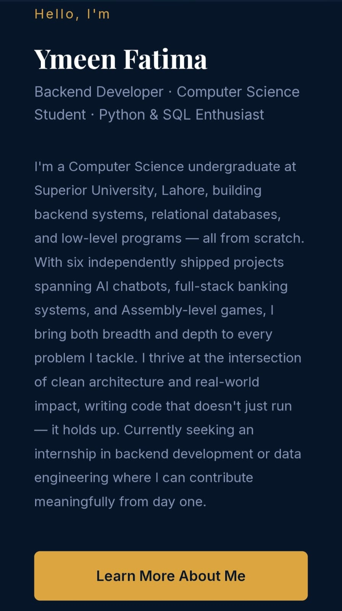
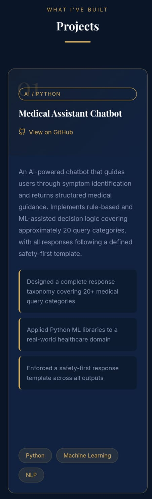

# 🌐 Personal Portfolio

Welcome to my personal portfolio website! This project showcases my skills, projects, and journey as a Computer Science student.

## 🚀 Live Demo

**Website:**
https://ymeenfatima.github.io/My-Portfolio/

---

## ✨ Features

* Responsive Design
* Modern User Interface
* About Me Section
* Skills Showcase
* Projects Section
* Contact Form

---

## 🛠️ Technologies Used

* HTML5
* CSS3
* JavaScript
* Git
* GitHub

---

## 📸 Screenshots

### Home Page

### About Section

### Projects Section

---

## 📂 Project Structure

My-Portfolio/

├── index.html

├── style.css

├── script.js

├── assets/

│ ├── portfolio-home.png

│ ├── about.png

│ └── projects.png

└── README.md

---

## 👩‍💻 Author

**Ymeen Fatima**

Portfolio:
https://ymeenfatima.github.io/My-Portfolio/

LinkedIn:
https://www.linkedin.com/in/ymeen-fatima

---

If you like this project, consider giving it a ⭐ on GitHub!
